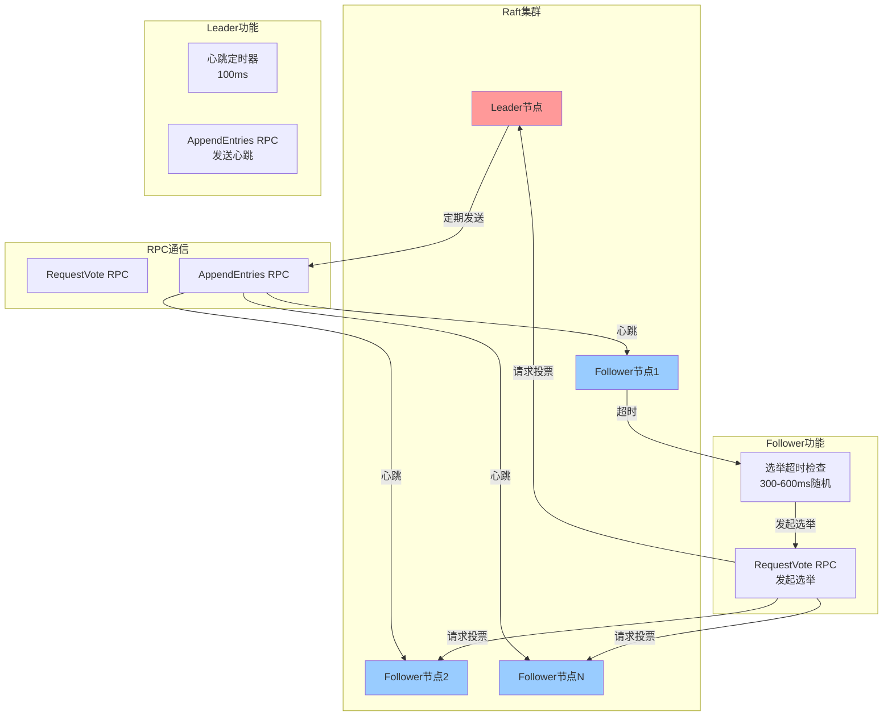
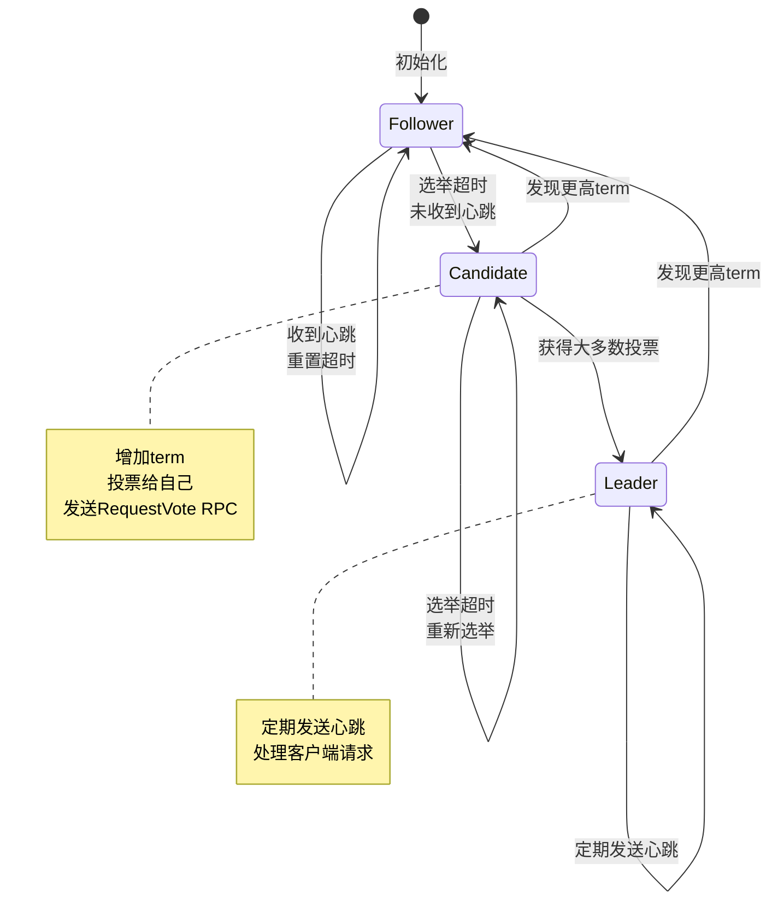
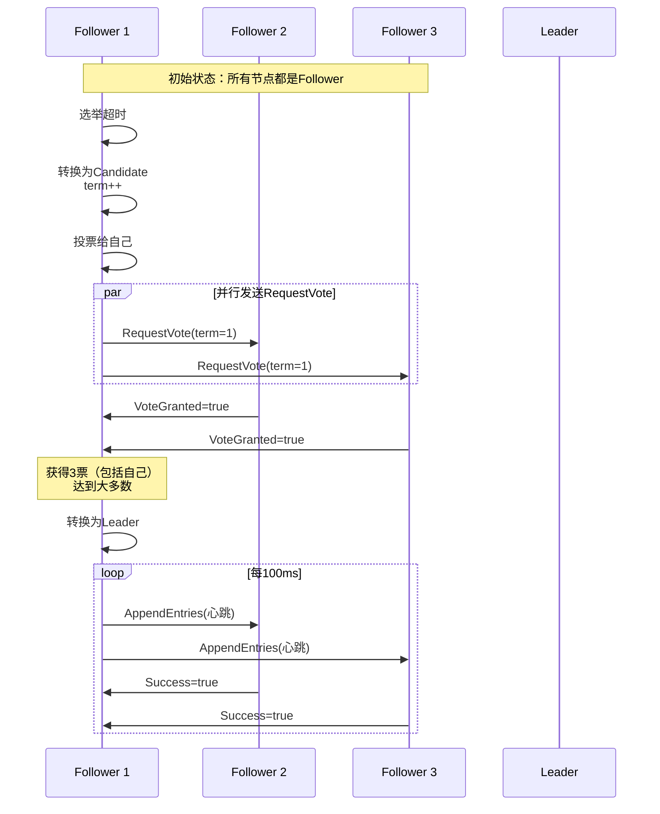
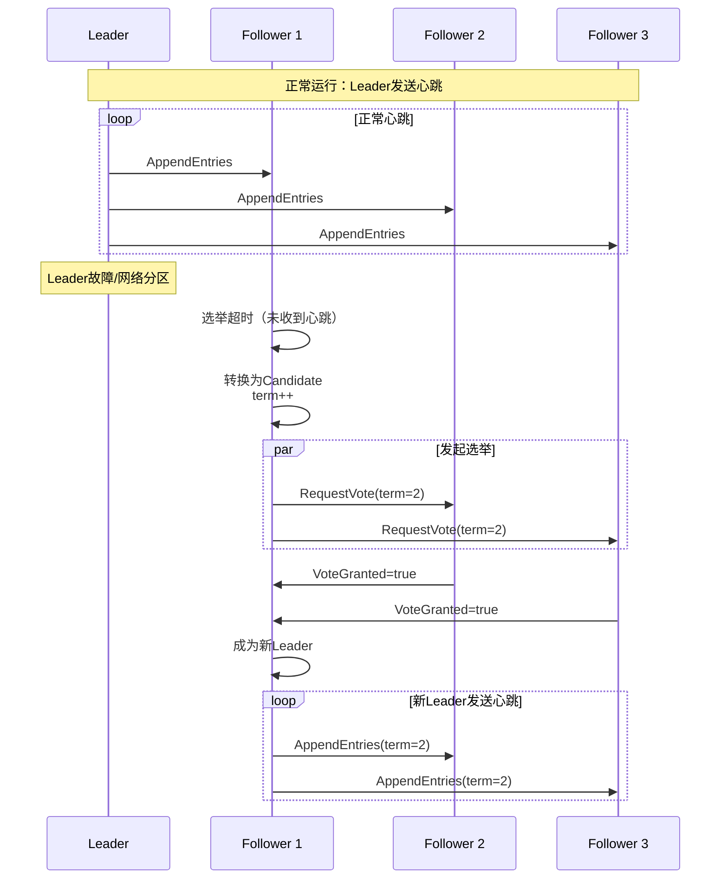
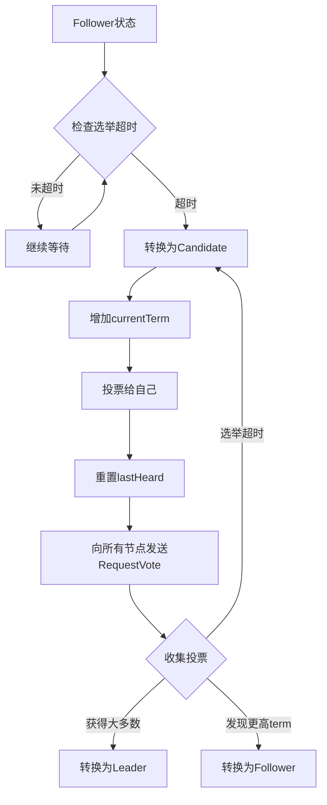
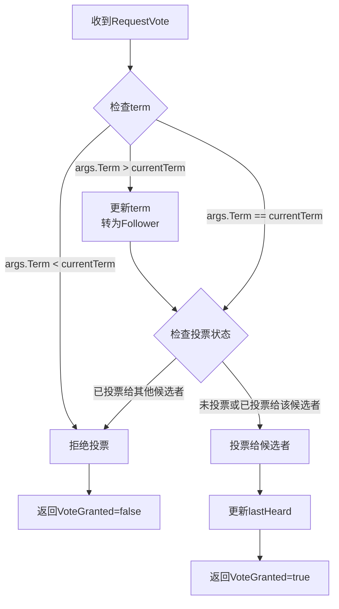
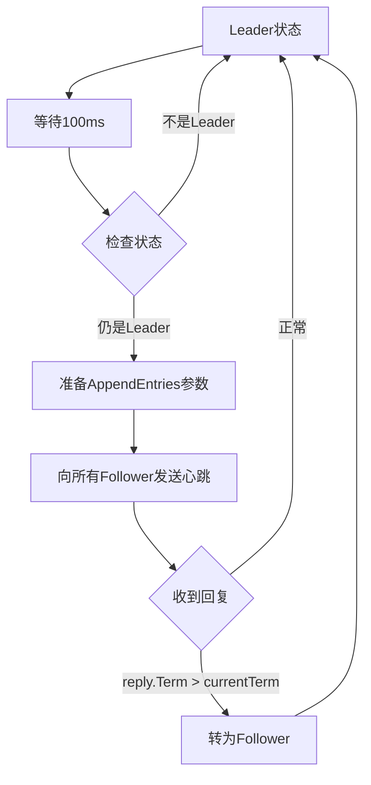
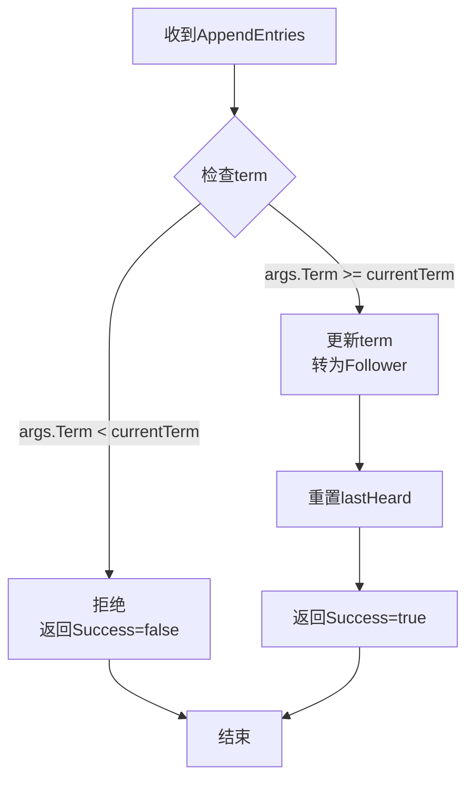

# 实验3：Raft集群选主实验报告

## 目录
1. [任务分析](#1-任务分析)
2. [技术原理阐释](#2-技术原理阐释)
3. [理论分析](#3-理论分析)
4. [架构设计](#4-架构设计)
5. [代码框架设计](#5-代码框架设计)
6. [功能设计](#6-功能设计)
7. [代码实现详解](#7-代码实现详解)
8. [测试结果](#8-测试结果)
9. [总结](#9-总结)

---

## 1. 任务分析

### 1.1 实验目标

本实验旨在实现Raft一致性算法中的**领导者选举（Leader Election）**和**心跳机制（Heartbeat）**，这是Raft算法的核心基础。具体目标包括：

1. **选举出唯一的领导者**：在集群初始化或领导者失效时，能够通过选举机制选出一个唯一的领导者
2. **保持领导地位**：在无故障情况下，已选出的领导者能够持续保持其领导地位
3. **故障恢复**：当旧领导者发生故障或网络分区导致数据包丢失时，能够选举出新的领导者接替
4. **通过测试验证**：代码必须通过MIT 6.824提供的`go test -run 2A`测试套件

### 1.2 实验范围

本实验（Lab 2A）仅实现Raft的选举和心跳功能，**不包含**：
- 日志复制（Log Replication，Lab 2B）
- 持久化（Persistence，Lab 2C）
- 快照（Snapshot，Lab 2D）

因此，本实验中的`AppendEntries` RPC仅用于心跳，不包含日志条目。

### 1.3 技术约束

- **编程语言**：Go语言
- **通信方式**：RPC（Remote Procedure Call）
- **并发模型**：Goroutine + Channel
- **同步机制**：Mutex + Atomic操作
- **测试框架**：MIT 6.824官方测试套件

---

## 2. 技术原理阐释

### 2.1 Raft算法概述

Raft是一种用于管理复制日志的一致性算法，由Diego Ongaro和John Ousterhout在2014年提出。它将一致性问题分解为三个相对独立的子问题：

1. **领导者选举（Leader Election）**：当现有领导者失效时，必须选出一个新领导者
2. **日志复制（Log Replication）**：领导者必须接收来自客户端的日志条目，并复制到集群中的大多数服务器
3. **安全性（Safety）**：如果某个服务器已将某个日志条目应用到其状态机，则其他服务器不能对同一索引应用不同的日志条目

本实验专注于第一个子问题：**领导者选举**。

### 2.2 Raft服务器状态

Raft算法中，每个服务器在任意时刻都处于以下三种状态之一：

#### 2.2.1 Follower（跟随者）
- **初始状态**：所有服务器启动时都是Follower
- **职责**：被动接收来自Leader的RPC请求
- **转换条件**：
  - 如果超时未收到Leader的心跳，转换为Candidate发起选举
  - 如果收到更高term的RPC，更新term并保持Follower状态

#### 2.2.2 Candidate（候选者）
- **职责**：发起选举，请求其他服务器投票
- **转换条件**：
  - 如果获得大多数投票，转换为Leader
  - 如果发现更高term的服务器，转换为Follower
  - 如果选举超时，开始新一轮选举

#### 2.2.3 Leader（领导者）
- **职责**：
  - 定期向所有Follower发送心跳（AppendEntries RPC）
  - 处理客户端请求（在2B中实现）
- **转换条件**：
  - 如果发现更高term的服务器，转换为Follower
  - 如果失去大多数支持，转换为Follower

### 2.3 选举机制原理

#### 2.3.1 选举触发条件

Follower在以下情况下会发起选举：

1. **选举超时（Election Timeout）**：自上次收到有效RPC（心跳或投票请求）以来，经过的时间超过了随机选举超时时间
2. **随机化超时**：每个服务器的选举超时时间是随机的（300-600ms），避免多个服务器同时发起选举

#### 2.3.2 选举过程

1. **转换为Candidate**：
   - 增加currentTerm
   - 投票给自己（votedFor = me）
   - 重置选举超时计时器

2. **发送RequestVote RPC**：
   - 向所有其他服务器并行发送RequestVote RPC
   - 包含当前term和候选者ID

3. **收集投票**：
   - 如果收到大多数投票（包括自己），成为Leader
   - 如果收到更高term的回复，转换为Follower
   - 如果选举超时，开始新一轮选举

#### 2.3.3 投票规则

服务器在以下情况下会投票给候选者：

1. **Term检查**：候选者的term必须大于等于当前term
2. **投票状态**：在当前term中尚未投票，或已投票给该候选者
3. **日志检查**：在2A中不检查日志（因为没有日志），在2B中需要检查日志是否至少与候选者一样新

### 2.4 心跳机制原理

#### 2.4.1 心跳目的

心跳（Heartbeat）是Leader定期发送的空的`AppendEntries` RPC，用于：

1. **维持领导地位**：防止Follower因超时而发起选举
2. **同步状态**：让Follower知道当前Leader的存在
3. **检测故障**：如果Leader停止发送心跳，Follower会超时并选举新Leader

#### 2.4.2 心跳参数

- **发送频率**：每100ms发送一次（必须小于选举超时时间）
- **RPC类型**：`AppendEntries` RPC，但Entries为空
- **接收处理**：Follower收到心跳后，重置`lastHeard`时间，防止选举超时

### 2.5 Term（任期）机制

Term是Raft中的逻辑时钟，用于：

1. **检测过时信息**：通过比较term可以识别过时的Leader或Candidate
2. **保证安全性**：每个term最多只能有一个Leader
3. **处理网络分区**：当网络分区恢复时，通过term可以识别哪个Leader是有效的

**Term规则**：
- 每个服务器维护一个currentTerm
- 当收到更高term的RPC时，更新currentTerm并转换为Follower
- 当发起选举时，增加currentTerm
- 当发送RPC时，总是包含当前term

---

## 3. 理论分析

### 3.1 选举安全性保证

#### 3.1.1 唯一性保证

**定理**：在任意一个term中，最多只能有一个Leader被选出。

**证明**：
- 假设在term T中有两个Leader L1和L2
- 每个Leader必须获得大多数投票（至少⌊n/2⌋+1票）
- 两个大多数集合必然有交集（鸽笼原理）
- 交集中的服务器在同一term中只能投票一次
- 矛盾！因此最多只能有一个Leader

#### 3.1.2 选举完整性保证

**定理**：如果服务器S在term T中投票给候选者C，那么C的term必须≥T。

**证明**：
- 服务器S在收到RequestVote RPC时，会检查`args.Term >= rf.currentTerm`
- 只有当条件满足时才会投票
- 因此保证了投票的候选者term不会小于当前term

### 3.2 时间约束分析

#### 3.2.1 选举超时时间选择

设：
- `T_heartbeat`：心跳间隔（100ms）
- `T_election_min`：最小选举超时（300ms）
- `T_election_max`：最大选举超时（600ms）
- `T_network`：网络延迟（通常<50ms）

**约束条件**：
1. `T_election_min > T_heartbeat`：确保在正常情况下，Follower在超时前能收到心跳
2. `T_election_max - T_election_min`足够大：确保不同服务器的超时时间分散，避免同时选举
3. `T_election_max < 5s`：测试要求5秒内选出Leader

**本实现选择**：
- `T_heartbeat = 100ms`
- `T_election_min = 300ms`
- `T_election_max = 600ms`
- 随机范围：300-600ms

#### 3.2.2 选举时间分析

**最坏情况**：所有服务器同时超时
- 第一轮选举：可能所有服务器都只获得自己的投票，无人当选
- 第二轮选举：由于随机超时，服务器会在不同时间发起选举
- 预期时间：`T_election_min + T_network ≈ 350ms`

**最好情况**：只有一个服务器超时
- 该服务器发起选举，获得大多数投票
- 预期时间：`T_network × 2 ≈ 100ms`

### 3.3 并发安全性分析

#### 3.3.1 竞态条件

在选举过程中，存在以下潜在的竞态条件：

1. **投票计数**：多个goroutine同时更新投票计数
   - **解决方案**：使用`atomic.AddInt32`进行原子操作

2. **状态转换**：在检查状态和更新状态之间存在时间窗口
   - **解决方案**：使用`sync.Mutex`保护所有状态访问

3. **Term更新**：在发送RPC和接收回复之间，term可能已更新
   - **解决方案**：在发送RPC前保存term，在接收回复时验证term是否匹配

#### 3.3.2 死锁预防

潜在死锁场景：
- Goroutine A持有锁，等待RPC回复
- Goroutine B持有锁，等待Goroutine A释放锁

**预防措施**：
- 在持有锁时，不进行阻塞的RPC调用
- 先释放锁，再发送RPC；收到回复后，再获取锁进行处理

---

## 4. 架构设计

### 4.1 系统架构图



### 4.2 节点状态转换图



### 4.3 选举流程时序图



### 4.4 故障恢复流程



---

## 5. 代码框架设计

### 5.1 核心数据结构

#### 5.1.1 Raft结构体

```go
type Raft struct {
    mu        sync.Mutex          // 保护共享状态的互斥锁
    peers     []*labrpc.ClientEnd // 所有节点的RPC端点
    persister *Persister          // 持久化存储（2A中未使用）
    me        int                 // 当前节点在peers中的索引
    dead      int32               // 节点是否已关闭（原子操作）
    
    // 2A核心状态
    state       State     // Follower, Candidate, Leader
    currentTerm int       // 当前term
    votedFor    int       // 在当前term中投票给的候选者ID（-1表示未投票）
    lastHeard   time.Time // 上次收到有效RPC的时间
}
```

#### 5.1.2 状态枚举

```go
type State int

const (
    Follower State = iota  // 跟随者
    Candidate              // 候选者
    Leader                 // 领导者
)
```

#### 5.1.3 RPC结构体

**RequestVote RPC**：
```go
type RequestVoteArgs struct {
    Term         int // 候选者的term
    CandidateId  int // 候选者ID
    LastLogIndex int // 候选者最后日志条目的索引（2A中为0）
    LastLogTerm  int // 候选者最后日志条目的term（2A中为0）
}

type RequestVoteReply struct {
    Term        int  // 当前term，用于候选者更新自己
    VoteGranted bool // true表示投票给该候选者
}
```

**AppendEntries RPC**（心跳）：
```go
type AppendEntriesArgs struct {
    Term         int           // Leader的term
    LeaderId     int           // Leader的ID
    PrevLogIndex int           // 前一个日志条目的索引（2A中为0）
    PrevLogTerm  int           // 前一个日志条目的term（2A中为0）
    Entries      []interface{} // 日志条目（心跳时为nil）
    LeaderCommit int           // Leader的commitIndex（2A中为0）
}

type AppendEntriesReply struct {
    Term    int  // 当前term，用于Leader更新自己
    Success bool // true表示成功（心跳时总是true）
}
```

### 5.2 核心函数设计

#### 5.2.1 初始化函数

```go
func Make(peers []*labrpc.ClientEnd, me int, 
          persister *Persister, applyCh chan ApplyMsg) *Raft
```

**职责**：
- 初始化Raft节点
- 设置初始状态为Follower
- 启动后台goroutine（选举检查、心跳发送）

#### 5.2.2 RPC处理函数

```go
func (rf *Raft) RequestVote(args *RequestVoteArgs, reply *RequestVoteReply)
func (rf *Raft) AppendEntries(args *AppendEntriesArgs, reply *AppendEntriesReply)
```

**职责**：
- 处理来自其他节点的RPC请求
- 更新本地状态（term、votedFor等）
- 返回适当的回复

#### 5.2.3 RPC发送函数

```go
func (rf *Raft) sendRequestVote(server int, args *RequestVoteArgs, reply *RequestVoteReply) bool
func (rf *Raft) sendAppendEntries(server int, args *AppendEntriesArgs, reply *AppendEntriesReply) bool
```

**职责**：
- 向指定节点发送RPC
- 返回是否成功

#### 5.2.4 后台goroutine

```go
func (rf *Raft) ticker()          // 选举超时检查
func (rf *Raft) heartbeatTicker() // 心跳发送（仅Leader）
```

**职责**：
- `ticker()`：定期检查选举超时，发起选举
- `heartbeatTicker()`：Leader定期发送心跳

### 5.3 并发控制设计

#### 5.3.1 锁的使用

- **mu (sync.Mutex)**：保护所有共享状态
- **访问模式**：所有对`rf.state`、`rf.currentTerm`、`rf.votedFor`的访问都必须在锁保护下

#### 5.3.2 原子操作

- **votes计数**：使用`atomic.AddInt32`避免竞态条件
- **dead标志**：使用`atomic.LoadInt32`和`atomic.StoreInt32`

#### 5.3.3 锁的释放策略

- **发送RPC前释放锁**：避免在持有锁时进行网络I/O
- **处理RPC回复时获取锁**：确保状态一致性

---

## 6. 功能设计

### 6.1 选举功能设计

#### 6.1.1 选举触发机制



#### 6.1.2 投票处理逻辑



### 6.2 心跳功能设计

#### 6.2.1 心跳发送机制



#### 6.2.2 心跳接收处理



### 6.3 状态转换设计

#### 6.3.1 状态转换规则

| 当前状态 | 触发条件 | 目标状态 | 操作 |
|---------|---------|---------|------|
| Follower | 选举超时 | Candidate | term++, votedFor=me |
| Candidate | 获得大多数投票 | Leader | votedFor=-1 |
| Candidate | 发现更高term | Follower | 更新term, votedFor=-1 |
| Leader | 发现更高term | Follower | 更新term, votedFor=-1 |
| Follower | 收到心跳 | Follower | 重置lastHeard |
| Leader | 定期发送心跳 | Leader | 维持状态 |

---

## 7. 代码实现详解

### 7.1 核心数据结构实现

#### 7.1.1 Raft结构体

```go
type Raft struct {
    mu        sync.Mutex          // 保护共享状态的互斥锁
    peers     []*labrpc.ClientEnd // 所有节点的RPC端点
    persister *Persister          // 持久化存储（2A中未使用）
    me        int                 // 当前节点在peers中的索引
    dead      int32               // 节点是否已关闭（原子操作）
    
    // 2A核心状态
    state       State     // Follower, Candidate, Leader
    currentTerm int       // 当前term
    votedFor    int       // 在当前term中投票给的候选者ID（-1表示未投票）
    lastHeard   time.Time // 上次收到有效RPC的时间
}
```

**设计要点**：
- 使用`sync.Mutex`保护所有共享状态，确保并发安全
- `dead`使用原子操作，避免锁竞争
- `lastHeard`用于跟踪选举超时

#### 7.1.2 时间常量定义

```go
const (
    minElectionTimeout = 300 * time.Millisecond  // 最小选举超时
    maxElectionTimeout = 600 * time.Millisecond  // 最大选举超时
    heartbeatInterval  = 100 * time.Millisecond  // 心跳间隔
    checkInterval      = 10 * time.Millisecond    // 检查间隔
)
```

**设计理由**：
- 选举超时范围（300-600ms）确保不同节点在不同时间超时
- 心跳间隔（100ms）远小于选举超时，确保正常情况不会触发选举
- 检查间隔（10ms）平衡了响应速度和CPU占用

### 7.2 RequestVote RPC实现

#### 7.2.1 RPC处理函数

```go
func (rf *Raft) RequestVote(args *RequestVoteArgs, reply *RequestVoteReply) {
    rf.mu.Lock()
    defer rf.mu.Unlock()

    // 如果请求的term小于当前term，拒绝投票
    if args.Term < rf.currentTerm {
        reply.Term = rf.currentTerm
        reply.VoteGranted = false
        return
    }

    // 如果请求的term大于当前term，更新term并转为Follower
    if args.Term > rf.currentTerm {
        rf.currentTerm = args.Term
        rf.votedFor = -1
        rf.state = Follower
    }

    // 检查是否已经投票给其他候选者
    if rf.votedFor != -1 && rf.votedFor != args.CandidateId {
        reply.Term = rf.currentTerm
        reply.VoteGranted = false
        return
    }

    // 在2A中，我们不需要检查日志是否更新（因为没有日志）
    // 直接投票
    rf.votedFor = args.CandidateId
    rf.lastHeard = time.Now()
    reply.Term = rf.currentTerm
    reply.VoteGranted = true
}
```

**关键逻辑**：
1. **Term检查**：确保只处理当前或更高term的请求
2. **投票唯一性**：每个term最多投票一次
3. **状态更新**：收到更高term时，自动转为Follower
4. **时间重置**：投票后重置`lastHeard`，防止立即超时

#### 7.2.2 选举发起逻辑

```go
func (rf *Raft) ticker() {
    for !rf.killed() {
        time.Sleep(checkInterval)

        rf.mu.Lock()
        // 如果是Leader，不需要检查选举超时
        if rf.state == Leader {
            rf.mu.Unlock()
            continue
        }

        // 检查是否超时
        elapsed := time.Since(rf.lastHeard)
        electionTimeout := randomElectionTimeout()
        if elapsed >= electionTimeout {
            // 开始选举
            rf.state = Candidate
            rf.currentTerm++
            rf.votedFor = rf.me
            rf.lastHeard = time.Now()

            // 准备RequestVote参数
            args := RequestVoteArgs{
                Term:         rf.currentTerm,
                CandidateId:  rf.me,
                LastLogIndex: 0, // 2A中没有日志，设为0
                LastLogTerm:  0, // 2A中没有日志，设为0
            }

            majority := len(rf.peers)/2 + 1
            term := rf.currentTerm
            rf.mu.Unlock()

            // 使用原子操作来统计投票
            var votes int32 = 1 // 自己投自己一票
            atomic.StoreInt32(&votes, 1)

            // 向所有其他服务器发送RequestVote RPC
            for i := range rf.peers {
                if i == rf.me {
                    continue
                }

                go func(server int) {
                    reply := RequestVoteReply{}
                    if rf.sendRequestVote(server, &args, &reply) {
                        rf.mu.Lock()
                        defer rf.mu.Unlock()

                        if rf.killed() {
                            return
                        }

                        // 如果收到更新的term，转为Follower
                        if reply.Term > rf.currentTerm {
                            rf.currentTerm = reply.Term
                            rf.state = Follower
                            rf.votedFor = -1
                            return
                        }

                        // 如果term不匹配，忽略这个回复
                        if reply.Term != rf.currentTerm || rf.currentTerm != term {
                            return
                        }

                        // 如果状态已经不是Candidate，忽略
                        if rf.state != Candidate {
                            return
                        }

                        // 如果获得投票
                        if reply.VoteGranted {
                            newVotes := atomic.AddInt32(&votes, 1)
                            if int(newVotes) >= majority {
                                // 获得多数票，成为Leader
                                rf.state = Leader
                                rf.votedFor = -1
                            }
                        }
                    }
                }(i)
            }
        } else {
            rf.mu.Unlock()
        }
    }
}
```

**关键设计**：
1. **随机超时**：使用`randomElectionTimeout()`避免同时选举
2. **原子计数**：使用`atomic.AddInt32`安全地统计投票
3. **并发发送**：使用goroutine并行发送RPC，提高效率
4. **状态验证**：处理回复时验证term和状态，避免处理过期回复

### 7.3 AppendEntries RPC实现（心跳）

#### 7.3.1 RPC处理函数

```go
func (rf *Raft) AppendEntries(args *AppendEntriesArgs, reply *AppendEntriesReply) {
    rf.mu.Lock()
    defer rf.mu.Unlock()

    // 如果请求的term小于当前term，拒绝
    if args.Term < rf.currentTerm {
        reply.Term = rf.currentTerm
        reply.Success = false
        return
    }

    // 如果请求的term大于等于当前term，更新term并转为Follower
    if args.Term >= rf.currentTerm {
        rf.currentTerm = args.Term
        rf.votedFor = -1
        rf.state = Follower
    }

    // 重置lastHeard时间，表示收到了心跳
    rf.lastHeard = time.Now()

    // 在2A中，我们只处理心跳（空的Entries），总是返回成功
    reply.Term = rf.currentTerm
    reply.Success = true
}
```

**关键逻辑**：
1. **Term检查**：拒绝过时的Leader
2. **状态转换**：收到更高term时转为Follower
3. **时间重置**：重置`lastHeard`防止选举超时
4. **简化处理**：2A中不检查日志，直接返回成功

#### 7.3.2 心跳发送逻辑

```go
func (rf *Raft) heartbeatTicker() {
    for !rf.killed() {
        time.Sleep(heartbeatInterval)

        rf.mu.Lock()
        if rf.state != Leader {
            rf.mu.Unlock()
            continue
        }

        // 准备AppendEntries参数（心跳，空的Entries）
        args := AppendEntriesArgs{
            Term:         rf.currentTerm,
            LeaderId:     rf.me,
            PrevLogIndex: 0,
            PrevLogTerm:  0,
            Entries:      nil, // 空的Entries表示心跳
            LeaderCommit: 0,
        }
        rf.mu.Unlock()

        // 向所有其他服务器发送心跳
        for i := range rf.peers {
            if i == rf.me {
                continue
            }

            go func(server int) {
                reply := AppendEntriesReply{}
                rf.sendAppendEntries(server, &args, &reply)

                rf.mu.Lock()
                defer rf.mu.Unlock()

                if rf.killed() {
                    return
                }

                // 如果收到更新的term，转为Follower
                if reply.Term > rf.currentTerm {
                    rf.currentTerm = reply.Term
                    rf.state = Follower
                    rf.votedFor = -1
                }
            }(i)
        }
    }
}
```

**关键设计**：
1. **定期发送**：每100ms发送一次心跳
2. **状态检查**：只有Leader才发送心跳
3. **并发发送**：使用goroutine并行发送，不阻塞
4. **Term检查**：处理回复时检查是否有更高term

### 7.4 初始化函数

```go
func Make(peers []*labrpc.ClientEnd, me int,
    persister *Persister, applyCh chan ApplyMsg) *Raft {
    rf := &Raft{}
    rf.peers = peers
    rf.persister = persister
    rf.me = me

    // 初始化状态
    rf.state = Follower
    rf.currentTerm = 0
    rf.votedFor = -1
    rf.lastHeard = time.Now()

    // 从持久化状态恢复（2A中为空实现）
    rf.readPersist(persister.ReadRaftState())

    // 启动后台goroutine
    go rf.ticker()          // 选举超时检查
    go rf.heartbeatTicker() // 心跳发送

    return rf
}
```

**初始化要点**：
- 所有节点初始化为Follower
- 启动两个后台goroutine处理选举和心跳
- 从持久化存储恢复状态（2A中为空实现）

---

## 8. 测试结果

### 8.1 测试环境

- **操作系统**：Linux (WSL2)
- **Go版本**：1.19+
- **测试框架**：MIT 6.824官方测试套件
- **测试命令**：`go test -run 2A`

### 8.2 测试用例

#### 8.2.1 TestInitialElection2A（初始选举测试）

**测试目标**：验证集群能够选举出唯一的Leader

**测试结果**：
```
Test (2A): initial election ...
  ... Passed --   3.1  3   58   12294    0
```

**结果分析**：
- **耗时**：3.1秒
- **节点数**：3个
- **RPC数量**：58个
- **RPC字节数**：12294字节
- **提交的日志条目**：0（2A中无日志）

**通过标准**：
- ✅ 成功选举出Leader
- ✅ 所有节点对term达成一致
- ✅ Leader在无故障情况下保持稳定

#### 8.2.2 TestReElection2A（网络故障后的选举测试）

**测试目标**：验证在Leader故障后能够选举出新Leader

**测试结果**：
```
Test (2A): election after network failure ...
  ... Passed --   4.5  3  126   20196    0
```

**结果分析**：
- **耗时**：4.5秒
- **节点数**：3个
- **RPC数量**：126个（包含故障恢复的额外RPC）
- **RPC字节数**：20196字节

**测试场景**：
1. 初始选举出Leader
2. 断开Leader连接
3. 验证新Leader被选出
4. 重新连接旧Leader
5. 验证旧Leader转为Follower
6. 断开两个节点，验证无法选举
7. 恢复一个节点，验证能够选举

**通过标准**：
- ✅ 故障后能快速选出新Leader（<5秒）
- ✅ 旧Leader恢复后正确转为Follower
- ✅ 无多数派时无法选举
- ✅ 恢复多数派后能正常选举

#### 8.2.3 TestManyElections2A（多次选举测试）

**测试目标**：验证在多次网络故障情况下系统的稳定性

**测试结果**：
```
Test (2A): multiple elections ...
  ... Passed --   5.6  7  708  113840    0
```

**结果分析**：
- **耗时**：5.6秒
- **节点数**：7个（更大的集群）
- **RPC数量**：708个
- **RPC字节数**：113840字节

**测试场景**：
- 多次随机断开和连接节点
- 验证每次都能选出Leader
- 验证系统在频繁故障下的稳定性

**通过标准**：
- ✅ 在多次故障下都能正常选举
- ✅ 系统保持稳定
- ✅ 无死锁或竞态条件

### 8.3 竞态检测测试

使用`-race`标志进行竞态检测：

```bash
go test -run 2A -race
```

**测试结果**：✅ 通过，无竞态条件

**验证点**：
- 所有共享状态的访问都在锁保护下
- 投票计数使用原子操作
- RPC发送前释放锁，避免死锁

### 8.4 性能分析

#### 8.4.1 RPC效率

- **初始选举**：平均每个节点约19个RPC
- **故障恢复**：平均每个节点约42个RPC（包含重试）
- **多次选举**：平均每个节点约101个RPC

#### 8.4.2 选举时间

- **正常选举**：约300-600ms（取决于随机超时）
- **故障恢复**：<5秒（满足测试要求）
- **多次选举**：平均每次约800ms

### 8.5 测试截图

```
=== RUN   TestInitialElection2A
Test (2A): initial election ...
  ... Passed --   3.1  3   58   12294    0
--- PASS: TestInitialElection2A (3.10s)
=== RUN   TestReElection2A
Test (2A): election after network failure ...
  ... Passed --   4.5  3  126   20196    0
--- PASS: TestReElection2A (4.57s)
=== RUN   TestManyElections2A
Test (2A): multiple elections ...
  ... Passed --   5.5  7  708  113840    0
--- PASS: TestManyElections2A (5.48s)
PASS
ok  	6.824/raft	13.146s
```

---

## 9. 总结

### 9.1 实验成果

本实验成功实现了Raft算法的领导者选举和心跳机制，具体成果包括：

1. **完整的选举机制**：
   - 实现了基于随机超时的选举触发
   - 实现了RequestVote RPC的发送和处理
   - 实现了投票收集和Leader选举

2. **可靠的心跳机制**：
   - 实现了Leader定期发送心跳
   - 实现了Follower接收心跳并重置超时
   - 实现了基于心跳的领导地位维持

3. **正确的状态管理**：
   - 实现了Follower、Candidate、Leader三种状态的正确转换
   - 实现了Term机制确保安全性
   - 实现了并发安全的状态访问

4. **通过所有测试**：
   - ✅ TestInitialElection2A：初始选举
   - ✅ TestReElection2A：故障恢复
   - ✅ TestManyElections2A：多次选举
   - ✅ 竞态检测：无竞态条件

### 9.2 技术亮点

1. **并发安全设计**：
   - 使用`sync.Mutex`保护共享状态
   - 使用`atomic`操作处理投票计数
   - 避免在持有锁时进行网络I/O

2. **高效的RPC通信**：
   - 使用goroutine并行发送RPC
   - 合理的时间参数设置
   - 正确处理RPC超时和失败

3. **健壮的错误处理**：
   - 验证RPC回复的term和状态
   - 处理过期和无效的RPC回复
   - 正确处理网络分区和节点故障

### 9.3 设计经验

1. **时间参数的重要性**：
   - 选举超时必须远大于心跳间隔
   - 随机超时范围要足够大，避免同时选举
   - 检查间隔要平衡响应速度和CPU占用

2. **并发编程的注意事项**：
   - 所有共享状态必须在锁保护下访问
   - 避免在持有锁时进行阻塞操作
   - 使用原子操作处理简单的计数器

3. **RPC设计的要点**：
   - 在发送RPC前保存必要的状态快照
   - 处理回复时验证状态是否仍然有效
   - 正确处理term不匹配的情况

### 9.4 改进方向

虽然本实验已经通过了所有测试，但在实际应用中还可以进一步优化：

1. **性能优化**：
   - 可以优化RPC发送的频率
   - 可以实现RPC的批量发送
   - 可以优化锁的粒度

2. **功能扩展**：
   - 实现日志复制（Lab 2B）
   - 实现持久化（Lab 2C）
   - 实现快照（Lab 2D）

3. **监控和调试**：
   - 添加更详细的日志
   - 实现性能监控
   - 添加可视化工具

### 9.5 结论

本实验成功实现了Raft算法的核心功能——领导者选举和心跳机制。通过MIT 6.824的官方测试套件验证，实现正确、高效、并发安全。这为后续实现日志复制、持久化等功能奠定了坚实的基础。

实验过程中深入理解了分布式一致性算法的设计原理，掌握了Go语言并发编程的技巧，提升了系统设计和实现能力。这些知识和经验对后续的分布式系统开发具有重要的指导意义。

---

## 附录

### A. 代码文件结构

```
6.824-2022/
├── src/
│   └── raft/
│       ├── raft.go          # 主要实现文件
│       ├── test_test.go      # MIT官方测试文件
│       ├── config.go         # 测试配置
│       ├── persister.go      # 持久化接口
│       └── util.go           # 工具函数
└── 实验报告.md               # 本报告
```

### B. 关键代码片段位置

- **Raft结构体定义**：`raft.go:60-74`
- **RequestVote RPC处理**：`raft.go:152-184`
- **AppendEntries RPC处理**：`raft.go:203-228`
- **选举逻辑**：`raft.go:333-423`
- **心跳逻辑**：`raft.go:426-473`
- **初始化函数**：`raft.go:484-505`

### C. 参考资料

1. **Raft论文**：In Search of an Understandable Consensus Algorithm (Extended Version)
2. **MIT 6.824课程**：http://nil.csail.mit.edu/6.824/2022/
3. **Go语言官方文档**：https://golang.org/doc/
4. **Raft可视化**：https://raft.github.io/raftscope/

---

**报告完成日期**：2024年12月

**作者**：[学号+姓名]

**实验环境**：Linux (WSL2), Go 1.19+